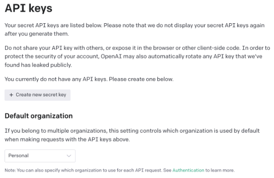
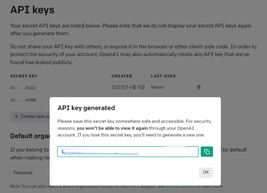

## OpenAI API 사용하기
https://platform.openai.com/docs/guides/chat

- chatgpt api를 사용할 수 있는 가이드<hr>

### Open AI API 발급받기
https://platform.openai.com/api-keys


Create new secret key를 눌러 사용할 수 있는 API key 발급

- 발급받은 key를 통해 api와 통신을 하고 사용한 만큼 요금이 부과가 되는 방식

### OpenAI API를 사용할 수 있는 패키지 설치
```pip install openai```
- 해당 패키지로 api를 연결하여 ChatGPT를 이용

### API 연결하기
```python
import openai

# 발급받은 API 키 설정
OPENAI_API_KEY = "오픈AI에서 발급받은 인증키"

# openai API 키 인증
openai.api_key = OPENAI_API_KEY
```
- 발급받은 API 키 값을 ‘OPENAI_API_KEY’ 변수에 할당
- ‘openai.api_key’에 이 값 할당

### ChatGPT API 사용하기
```python
# 모델 - GPT 3.5 Turbo 선택
model = "gpt-3.5-turbo"

# 질문 작성하기
query = "텍스트를 이미지로 그려주는 모델에 대해 알려줘."

# 메시지 설정하기
messages = [{
    "role": "system",
    "content": "You are a helpful assistant."
}, {
    "role": "user",
    "content": query
}]
```

- model : ‘gpt-3.5-turbo’ 모델로 설정해준다. 이 모델은 ChatGPT 애플리케이션에서 사용되는 것과 같은 언어 모델이다.
- query : 질문을 입력한다.
- messages : 대화에 참여하는 여러 역할(‘system(시스템)’, ‘assistant(도우미)’, ‘user(사용자)’)과 메시지 내용을 설정할 수 있다. 일반적으로 대화는 시스템 메시지가 먼저 오고 그 다음에 사용자 및 어시스턴트 메시지가 번갈아 가며 오는 형식으로 구성된다.
  - 시스템 메시지 : ‘You are a helpful assistant.’와 같은 메시지로 챗봇에게 일종의 역할을 부여
  - 사용자 메시지 : 도우미에게 직접 전달하는 내용
  - 도우미 메시지 : 이전 응답을 저장하는 데 도움이 되며, 개발자가 원하는 동작의 예를 제공하기 위해 사용

```python
# ChatGPT API 호출하기
response = openai.ChatCompletion.create(model=model, messages=messages)
answer = response['choices'][0]['message']['content']
answer
```
openai.ChatCompletion.create()에 위에서 정의한 파라미터를 입력하고 ‘response’에 값을 할당

response[‘choices’][0][‘message’][‘content’]를 호출하면 응답 메시지를 확인할 수 있음
<br>

### API 엔드포인트 설정
- API 호출을 수행할 대상 URL을 지정하는 것을 의미
- OpenAI의 ChatGPT API 엔드포인트는 https://api.openai.com/v1/chat/completions
  - 이 엔드포인트는 ChatGPT 모델을 사용하여 대화를 생성하는 데 사용

#### 엔드포인트 설정 방법
##### 1. 엔드포인트 설정
- 엔드포인트는 HTTP 요청을 보낼 때 사용하는 기본 URL
```python
# API 엔드포인트 설정
url = "https://api.openai.com/v1/chat/completions"
```

##### 2. HTTP 요청 만들기
- 이 엔드포인트를 사용하여 POST 요청을 만들어 OpenAI API에 데이터를 전송
ex)
```python
import requests

# API 키 설정
api_key = 'YOUR_API_KEY'

# API 엔드포인트 설정
url = "https://api.openai.com/v1/chat/completions"

# 헤더 설정
headers = {
    "Content-Type": "application/json",
    "Authorization": f"Bearer {api_key}"
}

# 데이터 설정
data = {
    "model": "gpt-4",
    "messages": [
        {"role": "system", "content": "You are a helpful assistant."},
        {"role": "user", "content": "안녕하세요, ChatGPT API를 사용하고 싶어요. 어떻게 해야 하나요?"}
    ],
    "temperature": 0.7
}

# 요청 보내기
response = requests.post(url, headers=headers, json=data)

# 응답 처리
if response.status_code == 200:
    result = response.json()
    
    # 'choices' 리스트에서 첫 번째 응답 추출
    response_message = result['choices'][0]['message']['content']
    
    # 필요한 정보 추출
    print("ChatGPT의 응답:", response_message)
    
    # 원하는 형식으로 데이터 가공
    formatted_response = {
        "응답": response_message,
        "토큰 사용량": result['usage']['total_tokens']
    }
    
    # 커스터마이징된 응답 출력
    print("커스터마이징된 응답:", formatted_response)
else:
    print(f"Error: {response.status_code}")
    print(response.text)
```
****
<b>요약</b><br>
1. API 키 설정: api_key 변수에 자신의 API 키를 저장합니다.
2. API 엔드포인트 설정: url 변수에 API 엔드포인트 URL을 설정합니다.
3. 헤더 설정: 요청 헤더에는 Content-Type과 Authorization을 포함합니다. Authorization 헤더는 Bearer 토큰 방식으로 API 키를 포함합니다.
4. 데이터 설정: 요청 본문에는 model, messages, temperature 등을 포함한 JSON 데이터를 설정합니다.
5. 요청 보내기: requests.post 함수를 사용하여 POST 요청을 보냅니다.
6. 응답 처리: 응답 상태 코드가 200(성공)일 경우 응답 데이터를 JSON 형식으로 파싱하고 필요한 정보를 추출하여 출력합니다.
이와 같이 엔드포인트를 설정하고 HTTP 요청을 만들어 API를 호출합니다.
<br><hr>
